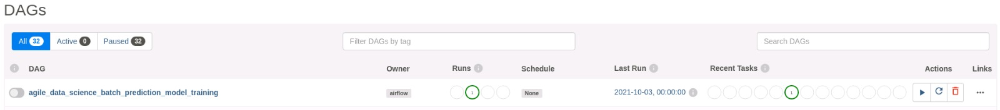

# BDFI_PRACTICA_VUELOS
Repositorio con la solucion implementada a la practica de vuelos de la asinatura de BDFI 2022

## Introducción
El objetivo de este proyecto de la asignatura de BDFI en el curso 2022-2023 es el de implementar un sistema que permite realizar predicciones de retraso de vuelos. Dicho sistema de predicción esta formado por una serie de módulos los cuales permiten realizar predicciones análiticas y en tiempo real a partir de una serie de trazas y asi poder mostrar el retraso del correspondiente vuelo.
A continuación se muestra la arquitecura del sistema desarrollado:

[](http://datasyndrome.com/video)

## "Arquitectura Back End"
## "Arquitectura Front End"
## "Proceso de Funcionamiento"
En este apartado se detalla en más en profundad el foncionamiento del sistema al completo:
1. Se descarga el dataset de los datos relacionados con los vuelos. Dicho dataset posee la información suficiente como para poder entrenar el modelo y predecir los retrasos. 
2. Se entrena el modelo de Machine Learning a partir del dataset.
3. Se despliega el job de prediccion de retrasos de los vuelos Spark,el cual realiza las predicciones mediante el modelo creado
4. Introducción de los datos del vuelo a predecir en el frontal web y su posterior envio al servidor web de Flask por medio de la cola de mensajería Kafka especificando el tópico.
5. Se entrena el modelo predictivo empleando el algoritmo RandomForest con los datos obtenidos.
6. El job de Spark en el servidor realiza la predicción de los retrasos de los vuelos por medio de los datos del tópico al que se encuentra suscrito de Kafka.
7. La ejecución del job se realiza por medio del fichero jar para Scala generado por medio de spark-submit.
8. Se guardan las diversas predicciones en la base de datos de Mongo.
9. Se realiza la consulta de los resultados de la prediccion a través del uso de polling que flask realiza sobre Mongo y se se muestran en el servidor web.
## "Componentes y herramientas utilizadas"
Es neceraria la instalación de cada componente incluido en los apartados de aquitectura:
- [Intellij](https://www.jetbrains.com/help/idea/installation-guide.html) (jdk_1.8)
- [Pyhton3](https://realpython.com/installing-python/) (versión 3.8)
- [PIP](https://pip.pypa.io/en/stable/installing/)
- [SBT](https://www.scala-sbt.org/release/docs/Setup.html) 
- [MongoDB](https://docs.mongodb.com/manual/installation/) (versión 4.4)
- [Spark](https://spark.apache.org/docs/latest/) (versión 3.1.2)
- [Scala](https://www.scala-lang.org) (versión 2.12)
- [Zookeeper](https://zookeeper.apache.org/releases.html) (versión 3.7.1)
- [Kafka](https://kafka.apache.org/quickstart) (versión 2.12-3.0.0)
- [Flask](https://flask.palletsprojects.com/en/2.2.x/)
- [Docker](https://www.docker.com/)
- A parte se puede desplegar la version dockerizada en plataformas como: [Google-Cloud](https://cloud.google.com/)
-El modelo también se puede entrenar con: [AirFlow](https://airflow.apache.org/docs/apache-airflow/stable/start.html)
## Hitos realizados
De los hitos propuestos en la presentación de la [Practica_big_data](https://github.com/ging/practica_big_data_2019) se han realizado los siguientes:
* *(4 puntos)* Lograr el funcionamiento de la práctica sin realizar modificaciones
*	*(1 punto)* Ejecución del job de predicción con Spark Submit en vez de IntelliJ
*	*(1 punto)* Dockerizar cada uno de los servicios que componen la arquitectura completa
*	*(1 punto)* Desplegar el escenario completo usando docker-compose
*	*(1 punto)* Desplegar el escenario completo en Google Cloud
*	*(2 puntos)* Entrenar el modelo con Apache Airflow
## Instrucciones de despliegue
### Despliegue manual en local
Para el desplieque manual se ha realizado una serie de scripts que facilita
### Despliegue utilizando Docker/Docker-compose
Para el despliegue de la aplicación utilizando docker-compose se deben seguir las indicaciones del fichero [Practica_big_data](https://github.com/ging/practica_big_data_2019) para instalar docker y docker-compose y a continuación desde la carpeta BDFI_PRACTICA_VUELOS
```
docker-compose up
```
Esto levantará la aplicación web en http://localhost:5000/flights/delays/predict_kafka y spark en http://localhost:8080.
### Despliegue en Google Cloud

```
git clone https://github.com/AGutierrezTorres/BDFI_PRACTICA_VUELOS
cd BDFI_PRACTICA_VUELOS
docker-compose up
```
### Apache airflow
#### Entrenar el modelo con Apache Airflow (manual)

- Instalar las depencias de Apache Airflow:

```
cd resources/airflow
pip install -r requirements.txt -c constraints.txt
```
- Establecemos la variable de entorno `PROJECT_HOME` :
```
export PROJECT_HOME=/home/user/Desktop/practica_big_data_2019
```
- Configurar el entorno de Airflow:

```
export AIRFLOW_HOME=~/airflow
mkdir $AIRFLOW_HOME/dags
mkdir $AIRFLOW_HOME/logs
mkdir $AIRFLOW_HOME/plugins
```
- Copiar el DAG definido en `resources/airflow/setup.py` en la carpeta dags creada en el paso anterior:

```
cp setup.py $AIRFLOW_HOME/dags
```

- Iniciar la bbdd de Airflow: 
```
airflow db init

airflow users create \
    --username admin \
    --firstname Jack \
    --lastname  Sparrow\
    --role Admin \
    --email example@mail.org
    --pass pass
```
- Iniciar el scheduler y el webserver:

```
airflow webserver --port 9090
airflow sheduler
```
- Se puede visitar http://localhost:9090/home para la ver la versión web de Apache Airflow. A continuación se muestra como ejemplo de ejecución de un DAG a través de linea de comandos el DAG creado con anterioridad:

```
airflow dags unpause agile_data_science_batch_prediction_model_training
airflow dags trigger agile_data_science_batch_prediction_model_training
```

#### Entrenar el modelo con Apache Airflow (dockerizado)
Consultar ficheros [Dockerfile](https://github.com/AGutierrezTorres/BDFI_PRACTICA_VUELOS/blob/main/dockers/airflow/Dockerfile) y [airflow.sh](https://github.com/AGutierrezTorres/BDFI_PRACTICA_VUELOS/blob/main/dockers/airflow/airflow.sh) alojados en `dockers/airflow`.
